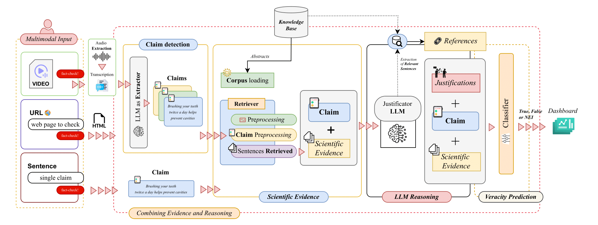

# 🩺 CER Demo: *Fact-Checking Biomedical Claims*

<div align="center">
    <a href="https://huggingface.co/spaces/praiselab-picuslab/CER-Fact-Checking" target="_blank"></a>
    <a href="LICENSE" target="_blank"></a>
</div>
<hr>

Welcome to the demo of the *CER (Combining Evidence and Reasoning)* system for fact-checking biomedical claims. This tool combines PubMed, one of the leading biomedical knowledge bases, with Large Language Models (LLMs) to verify the accuracy of claims, generate justifications, and provide reliable classifications.

### 🔍 Scientific References

This project leverages cutting-edge research in Generative AI, recommender systems, and sports analytics. If you use this project for your research, please cite [this paper](https://dl.acm.org/doi/abs/10.1145/3726302.3730155) 🙏.
```bash
@inproceedings{10.1145/3726302.3730155,
author = {Barone, Mariano and Romano, Antonio and Riccio, Giuseppe and Postiglione, Marco and Moscato, Vincenzo},
title = {Combating Biomedical Misinformation through Multi-modal Claim Detection and Evidence-based Verification},
year = {2025},
isbn = {9798400715921},
publisher = {Association for Computing Machinery},
address = {New York, NY, USA},
url = {https://doi.org/10.1145/3726302.3730155},
doi = {10.1145/3726302.3730155},
abstract = {Biomedical misinformation - ranging from misleading social media posts to fake news articles and deepfake videos - is increasingly pervasive across digital platforms, posing significant risks to public health and clinical decision-making. We developed CER, a comprehensive fact-checking system designed specifically for biomedical content. CER integrates specialized components for claim detection, scientific evidence retrieval, and veracity assessment, leveraging both transformer models and large language models to process textual and multimedia content. Unlike existing fact-checking systems that focus solely on structured text, CER can analyze claims from diverse sources including videos and web content through automatic transcription and text extraction. The system interfaces with PubMed for evidence retrieval, employing both sparse and dense retrieval methods to gather relevant scientific literature. Our evaluations on standard benchmarks including HealthFC, BioASQ-7, and SciFact demonstrate that CER achieves state-of-the-art performance, with F1-score improvements compared to existing approaches. To ensure reproducibility and transparency, we release the GitHub repository with the source code, within which you can reach an interactive demonstration of the system published on HuggingFace and a video demonstration of the system https://github.com/PRAISELab-PicusLab/CER-Fact-Checking.},
booktitle = {Proceedings of the 48th International ACM SIGIR Conference on Research and Development in Information Retrieval},
pages = {4025–4029},
numpages = {5},
keywords = {fact-checking, generative ai, healthcare, large language models},
location = {Padua, Italy},
series = {SIGIR '25}
}
```

## 🎥 Demo (or GIF)
[Watch our demo](CER-Biomedical_Fact_Checker.mp4) to see how CER supports biomedical fact-checking and enhances the transparency of scientific recommendations!

## 📊 Data Sources
We use the following data sources for training and evaluating the system:

- **[PubMed](https://pubmed.ncbi.nlm.nih.gov/)**: A biomedical database containing over 20 million abstracts.
- **HealthFC**: 750 biomedical claims curated by *Vladika et al. (2024)*.
- **BioASQ-7b**: 745 claims from the *BioASQ Challenge, Nentidis et al. (2020)*.
- **SciFact**: 1.4k expert-annotated scientific claims (*Wadden et al., 2020*).

## 🛠 Technologies Used
- **Python**: Core programming language.
- **FAISS Indexing**: For efficient retrieval of biomedical abstracts.
- [**Meta-Llama-3.1-405B-Instruct**](https://huggingface.co/hugging-quants/Meta-Llama-3.1-405B-Instruct-AWQ-INT4): Language model for generating justifications.
- **PubMedBERT**: Classifier for claim evaluation.
- **Streamlit**: For building an interactive user interface.

The system is designed to work on both lightweight setups (Intel i7 CPU, 16GB RAM) and advanced environments with GPUs (e.g., NVIDIA Tesla T4), supporting complex tasks on large datasets.

## 🔬 Methodological Workflow
CER follows a structured workflow in three main phases:

1. **Evidence Retrieval**: Relevant abstracts are extracted from PubMed using a BM25 retrieval engine.
2. **Justification Generation**: The LLM generates explanations based on the retrieved abstracts.
3. **Claim Classification**: The classifier evaluates each claim as true, false, or "not enough evidence."



## 🌟 Key Features
- **Zero-Shot and Fine-Tuned Classification**: Provides reliable fact-checking without the need for extensive task-specific labeled data.
- **Robustness Across Datasets**: Fine-tuning enhances model performance, even when the training and test sets differ.
- **Efficient Retrieval**: Leverages the Sparse Retriever for quick and accurate evidence extraction from PubMed.
- **Transparency**: Generates justifications to explain the classification of each claim, ensuring transparency and interpretability.

## 🚀 Getting Started
Follow these steps to use the CER system demo:

### Prerequisites
- **Python 3.9+**
- Required libraries: Install with the command:
  ```bash
  pip install -r requirements.txt
  ```

### Running the Application
1. **Clone the repository**:
    ```bash
    git clone https://github.com/picuslab/CER-Fact-Checking.git
    cd CER-Fact-Checking
    ```
2. **Create a virtual environment**:
    ```bash
    python -m venv venv
    source venv/bin/activate  # On Windows use `venv\Scripts\activate`
    ```
3. **Run the Streamlit application**:
    ```bash
    streamlit run app.py
    ```
    Open your browser and go to `http://localhost:8501` to interact with the application.

### Submitting Claims
Enter a biomedical claim, for example:
```
"Vitamin D reduces the risk of osteoporosis."
```
Observe the process of evidence retrieval, justification generation, and classification.

## 📈 Conclusions
CER demonstrates how fact-checking using LLMs and evidence retrieval techniques can improve the reliability of medical information. Fine-tuning LLMs proves to be a powerful strategy for enhancing accuracy in fact-checking, even across different datasets. The ability to separate prediction from explanation ensures transparency and reduces bias.

## ⚖ Ethical Considerations
**CER** is a decision-support tool, not a substitute for professional medical advice. All recommendations must be validated by authorized healthcare providers. This demo uses anonymized data for illustrative purposes.

## 🙏 Acknowledgments
Special thanks to the dataset creators, library developers, and the research team for their contributions to this project.

👨‍💻 This project was developed by Mariano Barone, Antonio Romano, Giuseppe Riccio, Marco Postiglione, and Vincenzo Moscato.

## 📜 License

This work is licensed under a
[Creative Commons Attribution-NonCommercial 4.0 International License][cc-by-nc].

[![CC BY-NC 4.0][cc-by-nc-image]][cc-by-nc]

[cc-by-nc]: https://creativecommons.org/licenses/by-nc/4.0/
[cc-by-nc-image]: https://licensebuttons.net/l/by-nc/4.0/88x31.png
[cc-by-nc-shield]: https://img.shields.io/badge/License-CC%20BY--NC%204.0-lightgrey.svg
